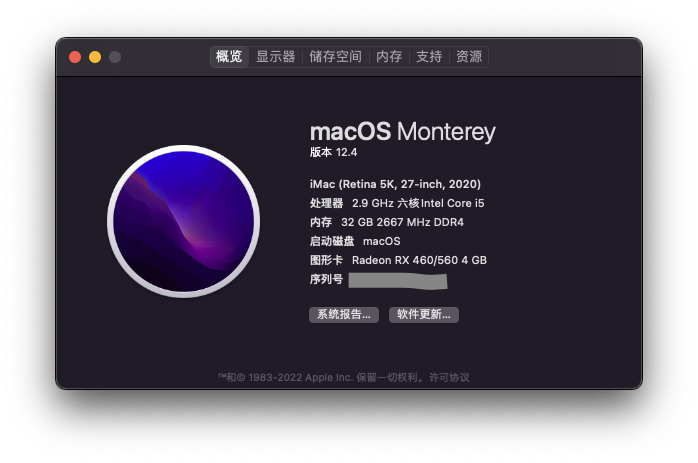
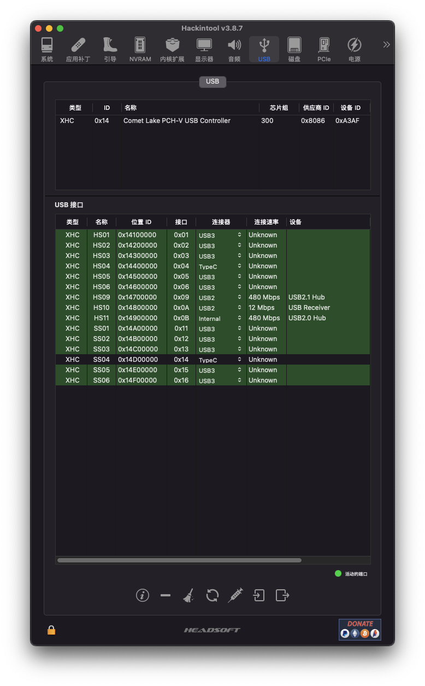

#OC0.8.2 开发版

# MSI-B460M-MORTAR-Hackintosh
微星B460M迫击炮黑苹果，个人自用长期更新维护

## 软件版本
* macOS： Ventura DP2 （全新安装，Monterey 升级不成功）
* OpenCore： [0.8.2](https://github.com/dortania/build-repo/releases/download/OpenCorePkg-e733af2/OpenCore-0.8.2-RELEASE.zip)
* 机型：MacPro7,1

～～～～

## 硬件配置
* 主板：微星B460M迫击炮（无WiFi版） 
* CPU：英特尔 i5 10400
* GPU：核显 UHD 630 + RX460
* 网卡：板载网卡 Realtek® RTL8125B 2.5G LAN
* 声卡：板载声卡 Realtek® ALC1200
* 硬盘：M.2 512GB （系统盘）+ SATA固态1TB用于照片存储
* 内存：32G
* 机箱：德商德静界 SILENTBASE 801 （好大个）

## USB 端口定制
|类型	|名称	    |位置ID	    |接口	|连接器	    |备注|
|------|--------|----------|--------|-----------|--------------|
|XHC	|HS01	|0x14100000	|0x01	|USB2	    |后置面板网口旁USB-A口|
|XHC	|HS02	|0x14200000	|0x02	|USB2	    |后置面板网口旁USB-A口|
|XHC	|HS03	|0x14300000	|0x03	|USB2	    |后置面板USB-C口旁USB-A口|
|XHC	|HS04	|0x14400000	|0x04	|TypeC+Sw	|后置面板USB-C口|
|XHC	|HS05	|0x14500000	|0x05	|USB2	    |主板扩展口JUSB3|
|XHC	|HS06	|0x14600000	|0x06	|USB2	    |主板扩展口JUSB3|
|XHC	|HS09	|0x14700000	|0x09	|USB2	    |后置面板PS2口旁USB-A口|
|XHC	|HS10	|0x14800000	|0x0A	|USB2	    |后置面板PS2口旁USB-A口|
|XHC	|HS11	|0x14900000	|0x0B	|Internel	|内置USB2.0Hub,主板扩展口JUSB1和JUSB2|
|XHC	|SS01	|0x14A00000	|0x11	|USB3	    |后置面板网口旁USB-A口|
|XHC	|SS02	|0x14B00000	|0x12	|USB3	    |后置面板网口旁USB-A口|
|XHC	|SS03	|0x14C00001	|0x13	|USB3	    |后置面板USB-C口旁USB-A口|
|XHC	|SS04	|0x14D00001	|0x14	|TypeC+Sw	|后置面板USB-C口|
|XHC	|SS05	|0x14E00002	|0x15	|USB3	    |主板扩展口JUSB3|
|XHC	|SS06	|0x14F00002	|0x16	|USB3	    |主板扩展口JUSB3|

## 已知问题
* 目前OC为开发者版本，0.8.2还未正式发布
* 主板旁边的PCI如果插入固态转接卡会无法启动，暂未找到方案
* 升级DP2后系统自动休眠后看到了几次不正常关机的提示。

## 感谢
* https://dortania.github.io/OpenCore-Install-Guide/
* https://github.com/ahuinee/OpenCore-EFI
* https://github.com/hurole/Hackintosh-MSI_B460M_MORTAR
* https://github.com/Spectrelai/Hackintosh-B460M-MORTAR-WIFI

## 工具
* ProperTree: https://github.com/corpnewt/ProperTree
* GenSMBIOS: https://github.com/corpnewt/GenSMBIOS
* gibMacOS：https://github.com/corpnewt/gibMacOS
* Hackintool：https://github.com/headkaze/Hackintool
* USBMap：https://github.com/corpnewt/USBMap
* OC开发版：https://dortania.github.io/builds/?product=OpenCorePkg&viewall=true